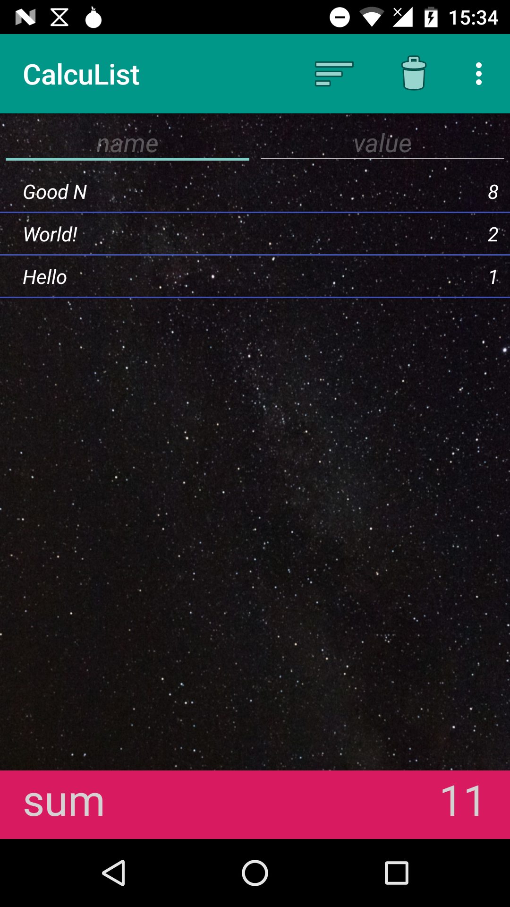

# CalcuList

CalcuList is an app that calculates the sum on the second column.

This app was first developed in Java.
While turning it into Kotlin-Code it got brushed up with a Room database and a RecyclerView.

- [Android Room with a View](https://codelabs.developers.google.com/codelabs/android-room-with-a-view-kotlin)
